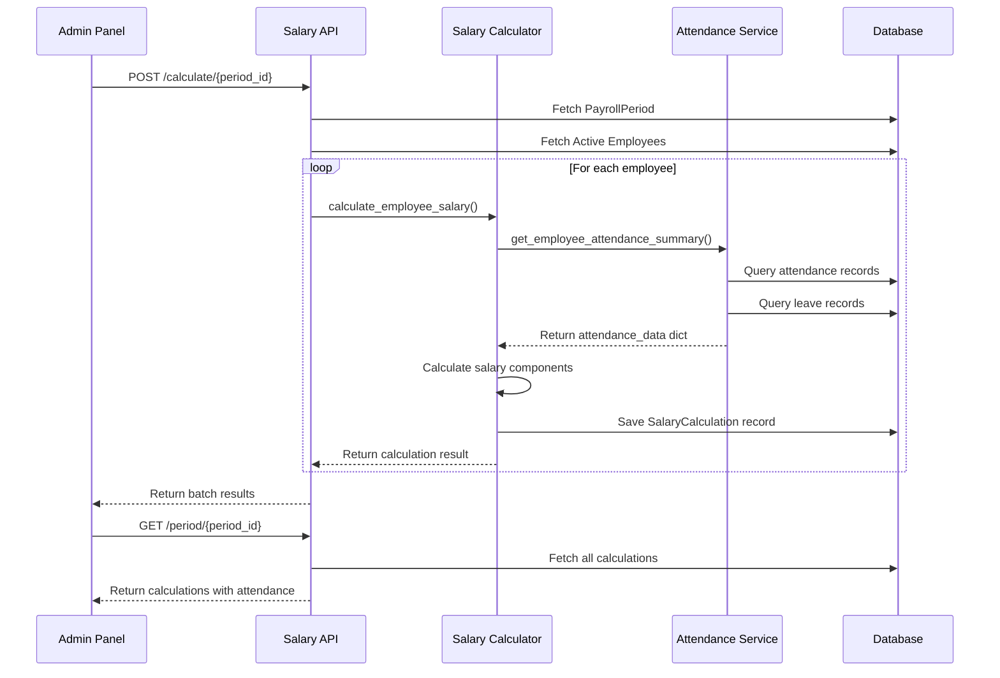
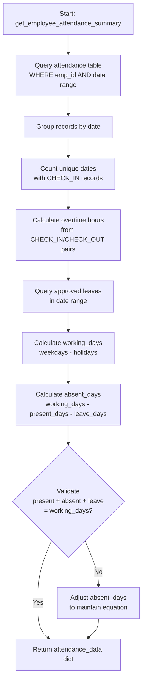
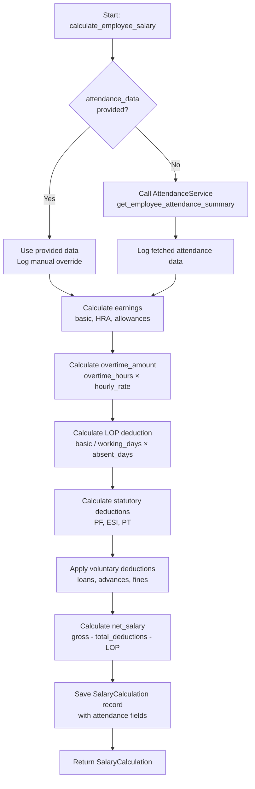

# Design Document: Attendance Integration for Salary Calculation

## Overview

This feature integrates real attendance data from the attendance tracking system into the salary calculation workflow. Currently, the salary calculator uses hardcoded default values (present_days=0, absent_days=26) for all employees. This design introduces an **Attendance Service** module that aggregates attendance records, leave records, and calculates overtime hours for each employee within a payroll period. The salary calculator will consume this data to compute accurate salaries with proper LOP (Loss of Pay) deductions and overtime compensation.

### Key Design Goals

1. **Accuracy**: Replace hardcoded attendance defaults with actual check-in/check-out data
2. **Graceful Degradation**: Handle employees with zero attendance records without errors
3. **Performance**: Batch-query attendance data for all employees to minimize database round trips
4. **Maintainability**: Encapsulate attendance logic in a dedicated service module
5. **Backward Compatibility**: Preserve existing API contracts and manual override capabilities
6. **Auditability**: Log attendance data fetches and store attendance summary in salary records

## Architecture

### High-Level Component Diagram

```mermaid
graph TB
    subgraph "Frontend Layer"
        AdminUI[Admin Panel<br/>SalaryCalculation.jsx]
    end
    
    subgraph "API Layer"
        SalaryAPI[Salary Calculation API<br/>salary_calculation.py]
    end
    
    subgraph "Service Layer"
        AttendanceService[Attendance Service<br/>attendance_service.py]
        SalaryCalc[Salary Calculator<br/>salary_calculator.py]
    end
    
    subgraph "Data Layer"
        AttendanceDB[(Attendance Table)]
        LeaveDB[(Leave Table)]
        PayrollDB[(Payroll Period Table)]
        SalaryDB[(Salary Calculation Table)]
    end
    
    AdminUI -->|POST /calculate/{period_id}| SalaryAPI
    AdminUI -->|GET /period/{period_id}| SalaryAPI
    SalaryAPI --> SalaryCalc
    SalaryCalc --> AttendanceService
    AttendanceService --> AttendanceDB
    AttendanceService --> LeaveDB
    AttendanceService --> PayrollDB
    SalaryCalc --> SalaryDB
```

### Data Flow Sequence



## Components and Interfaces

### 1. Attendance Service Module

**File**: `backend/app/services/attendance_service.py`

**Purpose**: Centralized service for aggregating attendance data, leave records, and calculating overtime hours.

**Core Function Signature**:

```python
async def get_employee_attendance_summary(
    db: AsyncSession,
    employee_id: str,
    start_date: date,
    end_date: date
) -> dict:
    """
    Aggregate attendance data for an employee within a date range.
    
    Returns:
        {
            "present_days": int,      # Days with at least one check-in
            "absent_days": int,       # working_days - present_days - leave_days
            "leave_days": int,        # Approved leave days
            "overtime_hours": float,  # Total OT hours (rounded to 2 decimals)
            "total_days": int,        # Calendar days in period
            "working_days": int       # Weekdays excluding holidays
        }
    """
```

**Internal Functions**:

```python
def _count_working_days(start_date: date, end_date: date) -> int:
    """Count weekdays (Mon-Fri) in date range, excluding holidays."""
    
def _calculate_present_days(attendance_records: List[Attendance]) -> int:
    """Count unique dates with check-in records."""
    
def _calculate_overtime_hours(attendance_records: List[Attendance], standard_hours: float = 8.0) -> float:
    """Sum overtime hours from check-in/check-out pairs."""
    
async def _get_approved_leave_days(db: AsyncSession, employee_id: str, start_date: date, end_date: date) -> int:
    """Query and sum approved leave days in date range."""
```

**Error Handling**:
- Database query failures: Log error, return default values (present_days=0, absent_days=26)
- Invalid date ranges: Raise ValueError
- Missing employee: Return default values with warning log

**Logging**:
- INFO: "Fetching attendance for employee {employee_id} from {start_date} to {end_date}"
- WARNING: "No attendance records found for employee {employee_id} in period {period_id}"
- ERROR: "Database error fetching attendance: {exception}"

### 2. Salary Calculator Integration

**File**: `backend/app/utils/salary_calculator.py`

**Modified Function**:

```python
async def calculate_employee_salary(
    self,
    employee_id: str,
    period_id: str,
    db: AsyncSession,
    calculated_by: str = None,
    attendance_data: Dict = None,  # Optional manual override
) -> SalaryCalculation:
    """
    Calculate salary for one employee.
    
    If attendance_data is None, fetch from AttendanceService.
    If attendance_data is provided, use it directly (manual override).
    """
```

**Integration Logic**:

```python
# Inside calculate_employee_salary()
if not attendance_data:
    # Fetch real attendance data
    attendance_data = await attendance_service.get_employee_attendance_summary(
        db=db,
        employee_id=employee_id,
        start_date=period.start_date.date(),
        end_date=period.end_date.date()
    )
    logger.debug(f"Fetched attendance for {employee_id}: {attendance_data}")
else:
    # Manual override provided
    logger.info(f"Using manual attendance override for employee {employee_id}")
    # Store override in calculation_details for audit
```

**Backward Compatibility**:
- Existing function signature preserved
- `attendance_data` parameter remains optional
- Default behavior changes from hardcoded values to fetching real data
- Manual overrides still supported via `attendance_data` parameter

### 3. Salary Calculation API Updates

**File**: `backend/app/routers/salary_calculation.py`

**Updated Schema**:

```python
class SalaryCalculationResponse(BaseModel):
    # ... existing fields ...
    present_days: int
    absent_days: int
    leave_days: int
    overtime_hours: Decimal
    # ... rest of fields ...
```

**Updated Endpoint**:

```python
@router.post("/calculate/{period_id}", status_code=status.HTTP_200_OK)
async def calculate_salary(
    period_id: str,
    payload: CalculateRequest,
    db: AsyncSession = Depends(get_db),
    current_user: User = Depends(get_current_user),
):
    """
    Calculate salary for employees in a period.
    
    Request Body:
        {
            "employee_ids": ["uuid1", "uuid2"],  # Optional, null = all employees
            "attendance_overrides": {            # Optional manual overrides
                "uuid1": {
                    "present_days": 20,
                    "absent_days": 6,
                    "leave_days": 0,
                    "overtime_hours": 5.5,
                    "total_days": 30,
                    "working_days": 26
                }
            }
        }
    """
```

**Validation Logic**:

```python
# Validate payroll period dates
if not period.start_date or not period.end_date:
    raise HTTPException(
        status_code=400,
        detail="Invalid payroll period: missing start_date or end_date"
    )

if period.start_date > period.end_date:
    raise HTTPException(
        status_code=400,
        detail="Invalid payroll period: start_date must be before end_date"
    )
```

### 4. Admin Panel UI Updates

**File**: `admin-panel/src/pages/SalaryCalculation.jsx`

**New Table Columns**:

```jsx
const columns = [
    { key: 'employee_name', label: 'Employee' },
    { key: 'present_days', label: 'Present Days' },
    { key: 'absent_days', label: 'Absent Days' },
    { key: 'leave_days', label: 'Leave Days' },
    { key: 'overtime_hours', label: 'OT Hours' },
    { key: 'gross_salary', label: 'Gross Salary' },
    { key: 'total_deductions', label: 'Deductions' },
    { key: 'net_salary', label: 'Net Salary' },
    { key: 'actions', label: 'Actions' }
];
```

**Warning Indicator Component**:

```jsx
const AttendanceWarning = ({ presentDays }) => {
    if (presentDays === 0) {
        return (
            <span 
                className="text-amber-600 ml-2" 
                title="No attendance records for this period"
            >
                ⚠
            </span>
        );
    }
    return null;
};
```

**Conditional Styling**:

```jsx
<td className={presentDays === 0 ? 'text-orange-600' : 'text-green-600'}>
    {presentDays}
</td>
```

## Data Models

### Attendance Table (Existing)

```python
class Attendance(Base):
    __tablename__ = "attendance"
    
    id: str                          # UUID primary key
    emp_id: str                      # Foreign key to employees
    attendance_type: AttendanceType  # CHECK_IN or CHECK_OUT
    date: Date                       # Attendance date (indexed)
    time: Time                       # Check-in/out time
    # ... other fields ...
```

**Query Pattern**:

```sql
SELECT * FROM attendance
WHERE emp_id = :employee_id
  AND date >= :start_date
  AND date <= :end_date
ORDER BY date, time;
```

### Leave Table (Existing)

```python
class Leave(Base):
    __tablename__ = "leaves"
    
    id: str
    emp_id: str
    leave_type: LeaveType
    from_date: Date
    to_date: Date
    total_days: Decimal
    status: LeaveStatus  # PENDING, APPROVED, REJECTED, CANCELLED
    # ... other fields ...
```

**Query Pattern**:

```sql
SELECT SUM(total_days) FROM leaves
WHERE emp_id = :employee_id
  AND status = 'APPROVED'
  AND from_date <= :end_date
  AND to_date >= :start_date;
```

### Salary Calculation Table (Existing - Already Has Attendance Fields)

```python
class SalaryCalculation(Base):
    __tablename__ = "salary_calculations"
    
    # Attendance fields (already exist in schema)
    total_days: int
    working_days: int
    present_days: int
    absent_days: int
    leave_days: int
    overtime_hours: Decimal
    
    # Earnings
    basic_salary: Decimal
    overtime_amount: Decimal
    gross_salary: Decimal
    
    # Deductions
    lop_deduction: Decimal
    total_deductions: Decimal
    net_salary: Decimal
    
    # Audit
    calculation_details: JSON  # Stores attendance_overrides if used
```

### Payroll Period Table (Existing)

```python
class PayrollPeriod(Base):
    __tablename__ = "payroll_periods"
    
    id: str
    period_name: str
    start_date: DateTime  # Period start (inclusive)
    end_date: DateTime    # Period end (inclusive)
    state: PayrollPeriodState
    # ... other fields ...
```

## Data Flow Details

### 1. Attendance Data Aggregation Flow



### 2. Salary Calculation Flow with Attendance



### 3. Batch Calculation Optimization

**Current Approach** (N+1 queries):
```python
for employee_id in employee_ids:
    attendance_data = await get_employee_attendance_summary(db, employee_id, ...)
    # N separate queries to attendance table
```

**Optimized Approach** (Single batch query):
```python
# Fetch all attendance records for all employees in one query
all_attendance = await db.execute(
    select(Attendance).where(
        Attendance.emp_id.in_(employee_ids),
        Attendance.date >= start_date,
        Attendance.date <= end_date
    )
)

# Group by employee_id in Python memory
attendance_by_employee = defaultdict(list)
for record in all_attendance.scalars():
    attendance_by_employee[record.emp_id].append(record)

# Process each employee's attendance data
for employee_id in employee_ids:
    records = attendance_by_employee.get(employee_id, [])
    attendance_data = _aggregate_attendance(records, ...)
```

**Performance Target**: Calculate salary for 100 employees in < 10 seconds (< 5 seconds for attendance fetch).

## Error Handling

### Attendance Service Error Scenarios

| Scenario | Handling Strategy | Return Value |
|----------|------------------|--------------|
| Database connection failure | Log ERROR, return defaults | `{present_days: 0, absent_days: 26, ...}` |
| Employee not found | Log WARNING, return defaults | `{present_days: 0, absent_days: 26, ...}` |
| Invalid date range (start > end) | Raise ValueError | Exception propagates to API |
| No attendance records | Log WARNING, return defaults | `{present_days: 0, absent_days: 26, ...}` |
| Attendance data integrity violation | Log WARNING, adjust values | Corrected attendance_data |

### Salary Calculator Error Scenarios

| Scenario | Handling Strategy | Response |
|----------|------------------|----------|
| Payroll period not found | Raise ValueError | API returns 404 |
| Period dates missing/invalid | Raise ValueError | API returns 400 with error message |
| Salary config not found | Raise ValueError | API returns error in batch results |
| Attendance service failure | Use default values, log error | Continue with defaults |
| Concurrent calculation | Use database transactions | Latest version wins, previous marked CANCELLED |

### API Error Responses

```python
# Invalid period dates
{
    "detail": "Invalid payroll period: start_date must be before end_date"
}

# Missing period dates
{
    "detail": "Invalid payroll period: missing start_date or end_date"
}

# Batch calculation with partial failures
{
    "period_id": "uuid",
    "total_processed": 95,
    "total_errors": 5,
    "results": [...],
    "errors": [
        {"employee_id": "uuid1", "error": "No active salary config"},
        {"employee_id": "uuid2", "error": "Calculation failed: ..."}
    ]
}
```

## Testing Strategy

### Unit Tests

**Attendance Service Tests** (`tests/services/test_attendance_service.py`):

1. **Test: Full attendance (all working days present)**
   - Setup: Create 26 attendance records for 26 working days
   - Assert: present_days=26, absent_days=0, leave_days=0

2. **Test: Zero attendance**
   - Setup: No attendance records
   - Assert: present_days=0, absent_days=26, leave_days=0

3. **Test: Partial attendance with leaves**
   - Setup: 15 present days, 5 approved leave days
   - Assert: present_days=15, absent_days=6, leave_days=5

4. **Test: Overtime calculation**
   - Setup: Attendance records with check_in and check_out times
   - Assert: overtime_hours calculated correctly (working_hours - 8.0)

5. **Test: Date range filtering**
   - Setup: Attendance records before, during, and after period
   - Assert: Only records within period are counted

6. **Test: Multiple check-ins same day**
   - Setup: 3 check-in records on same date
   - Assert: Counted as 1 present day

7. **Test: Leave overlap with attendance**
   - Setup: Approved leave and attendance on same date
   - Assert: Attendance takes precedence, not counted as leave

**Salary Calculator Tests** (`tests/utils/test_salary_calculator.py`):

1. **Test: LOP deduction for absent days**
   - Setup: absent_days=10, basic_salary=30000, working_days=26
   - Assert: lop_deduction = (30000/26) * 10 = 11538.46

2. **Test: Overtime amount calculation**
   - Setup: overtime_hours=10, hourly_rate=200
   - Assert: overtime_amount = 2000

3. **Test: Manual attendance override**
   - Setup: Provide attendance_data parameter
   - Assert: AttendanceService not called, provided data used

4. **Test: Zero attendance full LOP**
   - Setup: present_days=0, absent_days=26
   - Assert: net_salary reflects full LOP deduction

### Integration Tests

**End-to-End Salary Calculation** (`tests/integration/test_salary_with_attendance.py`):

1. **Test: Complete flow with real attendance**
   - Setup: Create employee, attendance records, payroll period
   - Execute: POST /calculate/{period_id}
   - Assert: SalaryCalculation record has correct attendance values and LOP

2. **Test: Batch calculation with mixed attendance**
   - Setup: 10 employees with varying attendance patterns
   - Execute: POST /calculate/{period_id}
   - Assert: All calculations complete, attendance values correct

3. **Test: API response includes attendance fields**
   - Setup: Calculate salary for employee
   - Execute: GET /employee/{id}/period/{period_id}
   - Assert: Response includes present_days, absent_days, leave_days, overtime_hours

4. **Test: Payslip generation with zero attendance**
   - Setup: Employee with present_days=0
   - Execute: Generate payslip
   - Assert: Payslip shows LOP deduction and warning

**Performance Tests**:

1. **Test: Batch calculation performance**
   - Setup: 100 employees, 30 days of attendance each
   - Execute: POST /calculate/{period_id}
   - Assert: Completes in < 10 seconds

### Property-Based Testing Assessment

**Is PBT Appropriate for This Feature?**

This feature involves:
- Database queries and aggregation (I/O operations)
- Integration with external systems (attendance table, leave table)
- Side effects (writing to salary_calculation table)
- Business logic with specific rules (LOP calculation, overtime calculation)

**Decision**: Property-based testing is **partially applicable** for pure calculation logic, but **not appropriate** for the full integration flow.

**Where PBT Applies**:
- Pure calculation functions (_calculate_overtime_hours, _count_working_days)
- Attendance data validation logic
- LOP deduction formula

**Where PBT Does NOT Apply**:
- Database query operations (use integration tests)
- API endpoints (use example-based tests)
- Full salary calculation flow (use integration tests)

**Testing Approach**:
- **Unit tests**: Example-based tests for specific scenarios
- **Integration tests**: End-to-end tests with test database
- **Property tests**: Limited to pure calculation functions (if time permits)

Given the nature of this feature (primarily integration and data aggregation), we will **skip the Correctness Properties section** and focus on comprehensive unit and integration tests.

## Implementation Plan

### Phase 1: Attendance Service Module

1. Create `backend/app/services/` directory
2. Implement `attendance_service.py` with core functions
3. Add logging configuration
4. Write unit tests for attendance service
5. Verify test coverage > 90%

### Phase 2: Salary Calculator Integration

1. Modify `salary_calculator.py` to call AttendanceService
2. Update LOP calculation logic
3. Update overtime calculation logic
4. Add logging for attendance data fetch
5. Write unit tests for updated calculator
6. Verify backward compatibility with manual overrides

### Phase 3: API Updates

1. Update `SalaryCalculationResponse` schema
2. Add `attendance_overrides` parameter to `CalculateRequest`
3. Add payroll period date validation
4. Update API documentation
5. Write integration tests for API endpoints

### Phase 4: Admin Panel UI

1. Add attendance columns to salary calculation table
2. Implement warning indicator for zero attendance
3. Add conditional styling for present_days
4. Update table layout for responsiveness
5. Test UI on various screen sizes

### Phase 5: Testing & Documentation

1. Run full test suite
2. Performance testing with 100+ employees
3. Update API documentation (/docs)
4. Create migration guide for existing deployments
5. Code review and final adjustments

## Security Considerations

1. **Authorization**: Only Admin and Supervisor roles can trigger salary calculations
2. **Data Validation**: Validate all date ranges and employee IDs before queries
3. **SQL Injection Prevention**: Use SQLAlchemy parameterized queries (already in place)
4. **Audit Trail**: Log all attendance data fetches with employee_id and timestamps
5. **Manual Override Audit**: Store attendance_overrides in calculation_details JSON for audit

## Performance Optimization

### Database Indexes

Ensure these indexes exist:

```sql
CREATE INDEX idx_attendance_emp_date ON attendance(emp_id, date);
CREATE INDEX idx_leave_emp_dates ON leaves(emp_id, from_date, to_date);
CREATE INDEX idx_salary_calc_emp_period ON salary_calculations(employee_id, period_id);
```

### Query Optimization

1. **Batch Fetching**: Single query for all employees' attendance
2. **In-Memory Aggregation**: Group and aggregate in Python after fetch
3. **Async Queries**: Use SQLAlchemy async session throughout
4. **Connection Pooling**: Configure appropriate pool size in database.py

### Caching Strategy

- **No caching** for attendance data (must be real-time)
- **Cache payroll period** during batch calculation (single fetch)
- **Cache working days calculation** per period (deterministic)

## Deployment Considerations

### Database Migration

No schema changes required - attendance fields already exist in `salary_calculations` table.

### Configuration

Add to `.env`:

```bash
# Attendance calculation settings
STANDARD_SHIFT_HOURS=8.0
WEEKEND_DAYS=6,0  # Saturday=6, Sunday=0
HOLIDAY_CALENDAR_ENABLED=false  # Future enhancement
```

### Rollback Plan

If issues arise:

1. Revert `salary_calculator.py` to use hardcoded defaults
2. Attendance Service can be disabled without breaking existing functionality
3. Manual overrides still work via `attendance_data` parameter

### Monitoring

Add metrics:

- Attendance fetch duration per employee
- Batch calculation duration
- Number of employees with zero attendance per period
- LOP deduction amounts per period

## Future Enhancements

1. **Holiday Calendar Integration**: Exclude company holidays from working_days calculation
2. **Shift-Based Overtime**: Support multiple shift types with different OT rules
3. **Attendance Correction Workflow**: Allow admins to correct attendance before salary calculation
4. **Real-Time Attendance Preview**: Show attendance summary before triggering calculation
5. **Attendance Alerts**: Notify admins of employees with zero attendance before payroll processing
6. **Half-Day Attendance**: Support half-day present/absent calculations
7. **Late Mark Integration**: Deduct half-days for late marks from leave balance

## Appendix

### API Endpoint Summary

| Method | Endpoint | Description |
|--------|----------|-------------|
| POST | `/v1/payroll/calculate/{period_id}` | Calculate salary for employees in period |
| GET | `/v1/payroll/employee/{employee_id}/period/{period_id}` | Get salary calculation for employee |
| GET | `/v1/payroll/period/{period_id}` | Get all calculations for period |
| PATCH | `/v1/payroll/calculation/{calc_id}/approve` | Approve salary calculation |

### Database Schema Reference

**Attendance Table**:
- Primary Key: `id` (UUID)
- Foreign Key: `emp_id` → `employees.id`
- Indexed: `emp_id`, `date`
- Key Fields: `attendance_type`, `date`, `time`

**Leave Table**:
- Primary Key: `id` (UUID)
- Foreign Key: `emp_id` → `employees.id`
- Key Fields: `from_date`, `to_date`, `total_days`, `status`

**Salary Calculation Table**:
- Primary Key: `id` (UUID)
- Foreign Keys: `employee_id`, `period_id`
- Unique Constraint: `(employee_id, period_id, calculation_version)`
- Attendance Fields: `present_days`, `absent_days`, `leave_days`, `overtime_hours`

### Calculation Formulas

**Working Days**:
```
working_days = count(weekdays in [start_date, end_date]) - holidays
```

**Present Days**:
```
present_days = count(distinct dates with CHECK_IN records)
```

**Absent Days**:
```
absent_days = working_days - present_days - leave_days
```

**Overtime Hours**:
```
For each day with CHECK_IN and CHECK_OUT:
    working_hours = (check_out_time - check_in_time) in hours
    daily_ot = max(0, working_hours - standard_shift_hours)
overtime_hours = sum(daily_ot for all days)
```

**LOP Deduction**:
```
daily_rate = basic_salary / working_days
lop_deduction = daily_rate × absent_days
```

**Overtime Amount**:
```
hourly_rate = basic_salary / (working_days × standard_shift_hours)
overtime_amount = overtime_hours × hourly_rate × overtime_multiplier
```

---

**Document Version**: 1.0  
**Last Updated**: 2024  
**Status**: Ready for Implementation
